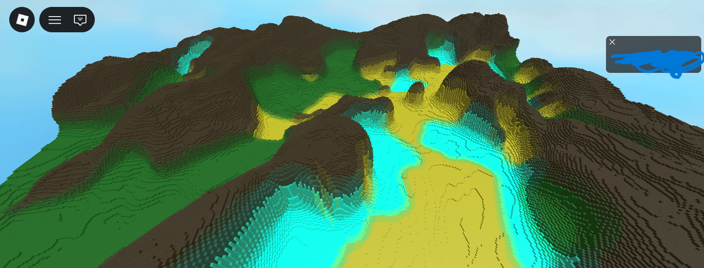
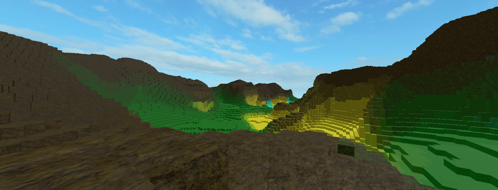
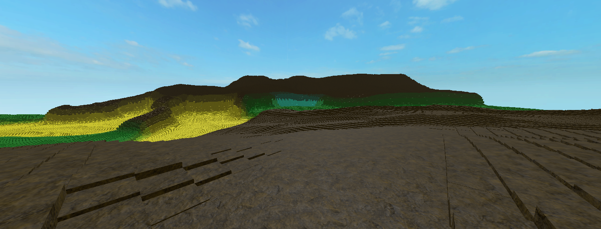
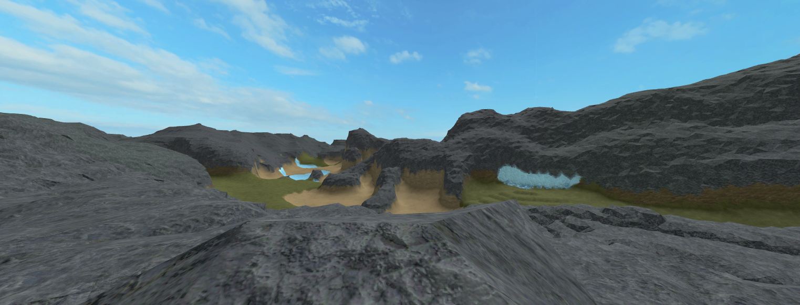
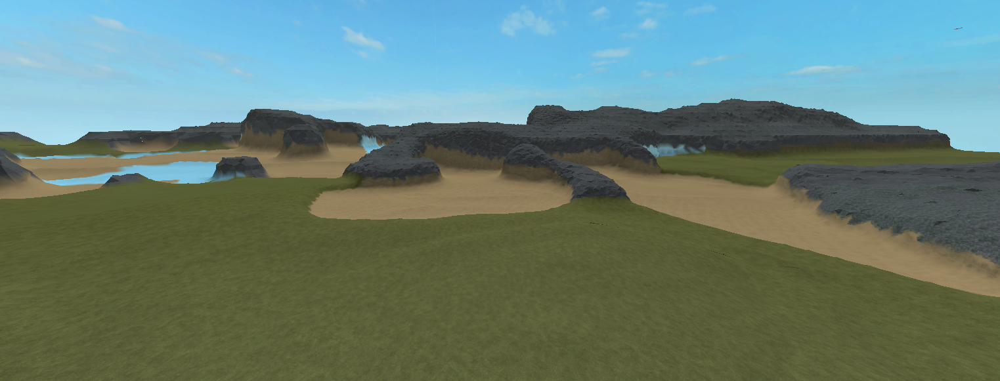

# WorldWeaver

A powerful roblox terrain generation tool that lets you generate terrain procedurally. It provides you with an extensive set of settings that allow you to generate the type of terrian you want, with the type of biomes you want, similar to how minecraft works.

# Getting Started

### Proper Paths
Make sure the paths to modules are properly sourced. Especially the one sourcing the Painting module in Generator:

```lua
-- Generator.luau
local Painting = require(script.Parent.Painting)
```

### Create a script
First create a script and make variables linking to the Modules Settings and Generator:

```lua
local Settings = require(path_to_settings_module)
local Generator = require(path_to_generator_module)
```

### Create a settings object

Initialize a Settings object by running:

```lua
local new_Settings = Settings.new()

-- Changes to these new settings (Interpolation Values to be specific)
-- should be made here

-- ///////
new_Settings:BuildInterpolationCache() -- this is necessary for proper smooth terrain
```

This ensures you can make different settings (such as different size, amplitudes, etc)
to your liking or if there different maps at different places within the server,
those maps could each have their own settings.

### Generate Terrain

```lua
local new_Settings = Settings.new()

new_Settings:BuildInterpolationCache()

Generator.generateTerrain(new_Settings)
```
voila! run the script and watch your terrain generate realtime!

# Best Practices

### Size on all axis are better off equal

Although this is not strictly necessary.

There are size parameters that control the size of your terrain:
```lua
Settings.MapWidth = 600
Settings.MapBreadth = 600
```
The best practice that ensures your terrain generates without hiccups would be
to make these values equal, that is:
```lua
Settings.MapWidth = 300
Settings.MapBreadth = 300
```

### Size should be a multiple of division
This setting is what controls how much area (in this case 600 by 600) will be generated in a single moment:
```lua
Settings.CaveDisabledMapDIV = 600 -- or 300 whatever you like
```
Make sure your width and breath are a multiple of this (in our case a multiple of 600):
```lua
Settings.MapWidth = 600 -- or 1200 or 1800
Settings.MapBreadth = 600 -- or 1200 or 1800 
```
or it should be less than the division itself
```lua
Settings.MapWidth = 300 -- or 175 or 500
Settings.MapBreadth = 300 -- or 175 or 500
```

### Don't go for too many blocks
if the size is too large (like 1200 by 1200) roblox will
have a hard time closing and or will lag after a good while in run-time

the best way to deal with this would be to create your own
chunk loader and unloader that generates a certain chunk and 
ungenerates other (this might come in future updates)

In any case a size of 600 by 600 or 800 by 800 is a very big map in of itself
so you don't need to worry about that in first place.

### Use Roblox's in built terrain generator for generating large maps

If you want to make maps as large as 2000 by 2000 studs or More, you should use Roblox's
in built terrain generator by setting:

```lua
Settings.useInBuiltTerrain = true
```
Though you would be better off setting fast blend to true as well for faster and efficient calculation of terrain:

```lua
Settings.fastBlend = true
```

### FastBlend or normal Blend?

You can choose any, and see whose results you like the more. Normal blend blends more whereas
fastblend gives more characteristics to biomes. Both look nice in their own way, so it is subjective.
Although, if you are generating very large maps, going with fast blend is better.

# Snapshots

## (Smoothify = false) + (useInBuiltTerrain = false)




## (Smoothify = true) + (useInBuiltTerrain = false)



## (Smoothify = false) + (useInBuiltTerrain = true)



## (Smoothify = true) + (useInBuiltTerrain = true)




